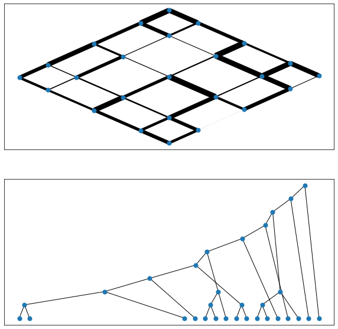
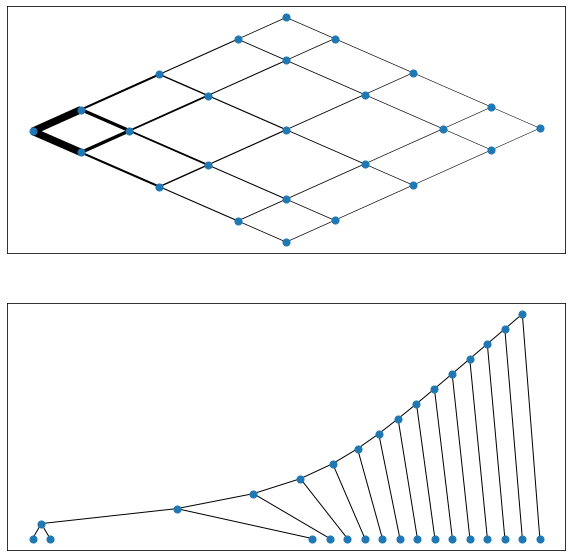

# cycle-coalescence-algorithm
##  Introduction

The repository does inlcude a jupyter notebook for testing predefined edge weight distributions on square lattices.
##  Installation
##  Usage

```python
import networkx as nx
# generate a dummy graph for testing
G=nx.grid_graph((7,7,1))

# put an edge weight distribution on the system, available are random/gradient/bigradient/nested_square

G=ag.generate_pattern(G,'nested_square')
weights=[G.edges[e]['weight'] for e in G.edges()]
pos=nx.get_node_attributes(G,'pos')
nx.draw_networkx(G,pos=pos,width=weights,with_labels=False,node_size=50,alpha=0.2)
# merge all shortest cycles and calc the merging tree's asymmetry
asymmetry=ag.calc_cycle_asymmetry(G)
print(asymmetry)
```

##  Requirements
```
networkx
numpy
```
##  Gallery
random weight distribution\n


nested square weight distribution\n


gradient weight distribution\n

## Acknowledgement
... written by Felix Kramer

This implementation is based on the cycle coalescence algorithm as described by Modes et al, 2016.
https://journals.aps.org/prx/pdf/10.1103/PhysRevX.6.031009
